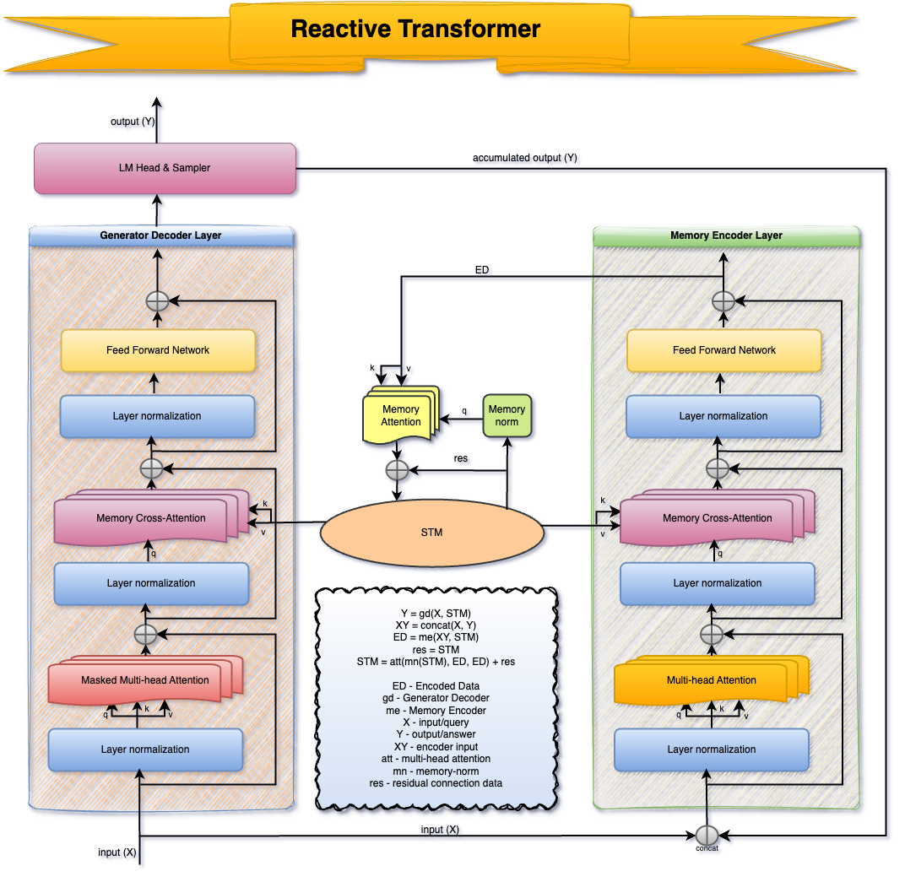
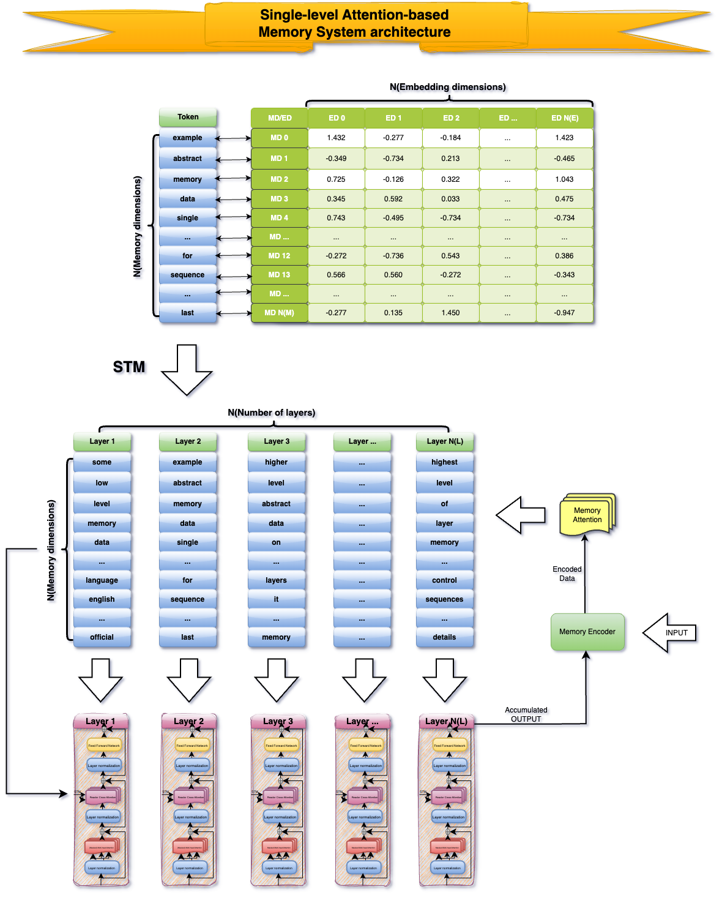

# Reactive Transformer: Real-time processing for language models
by Adam Filipek/Reactive AI

## Abstract
Language models based on Transformer architecture are industry standard in Natural Language Processing. They are great
in language modelling and generative tasks. However, Transformers are completely stateless, and they are only emulating Short-Term
Memory with their long contexts — every processed sequence is completely separate. Conversational models based on this concept,
are processing all the conversation history on each message/interaction. Despite it being extremely inefficient, it's not how humans
thinking and communicating. Awareness is a stateful and continuous process that requires _Real-time Processing_, which is completely
opposite to how transformers working.

Previous approaches to memory in NLP, based on RNNs or even Neural Turing Machines, were concentrated on keeping state between
tokens in sequence, because it was the main problem for research in pre-transformer times. After transformer architecture release,
it no longer requires memory, thanks to attention layers. Then, it looks like the research community forgot about memory and
agreed that it's no longer necessary.

Someone even believed that transformers would achieve awareness only by scaling it furthermore to even bigger sizes. No, they
wouldn't, it's **impossible**. The key "feature" of awareness is that I rather know what I was doing or thinking 10 minutes
ago, without a need to read my whole-day history.

Awareness requires keeping state between sequences/interactions instead and processing only single messages in real-time,
with access to previous interactions by memory. It's only the first step to awareness, but this step is crucial.

In this research, we are introducing **Reactive Transformer** architecture and **Attention-based Short-Term Memory System**,
that's processing only single messages and moving conversation history into separate memory layers, accessed and updated
by specialized attention layers.

## Architecture
**Reactive Transformer** includes encoder and decoder, as in original transformer, but the execution is reversed. First,
a message should be processed by decoder with the previous STM state, generating full response streamed out to
environment. Then, a concatenated message and response is passed to encoder, transforming it to latent memory spaces on
each layer. Finally, memory attention network is using encoded data to update Short-Term Memory layers. Both encoder and
decoder have memory-cross attention layers, placed between self-attention and feed forward, used to access memory state.

## Attention-based Memory System

# WORK IN PROGRESS